# Day 0.1：Pi 操作系统安装

> Day 0.1 前置任务：为 Snap2Know 设备烧录操作系统

## 前置要求

- **TF 卡**：64GB（推荐 Class 10 / A2）
- **读卡器**：USB 3.0（加快写入速度）
- **软件**：[Raspberry Pi Imager](https://www.raspberrypi.com/software/)

---

## 步骤 1：下载并安装 Raspberry Pi Imager

前往官网下载适用于您操作系统的版本：
- [Raspberry Pi Imager 下载页面](https://www.raspberrypi.com/software/)

---

## 步骤 2：烧录配置

### 2.1 选择设备
选择 **Raspberry Pi 5**


### 2.2 选择操作系统
选择 **Raspberry Pi OS (64-bit)** — 必须是 64 位版本（trixie）

> ⚠️ **重要**：不要选择 Lite 版本，Snap2Know 需要桌面环境进行初始配置

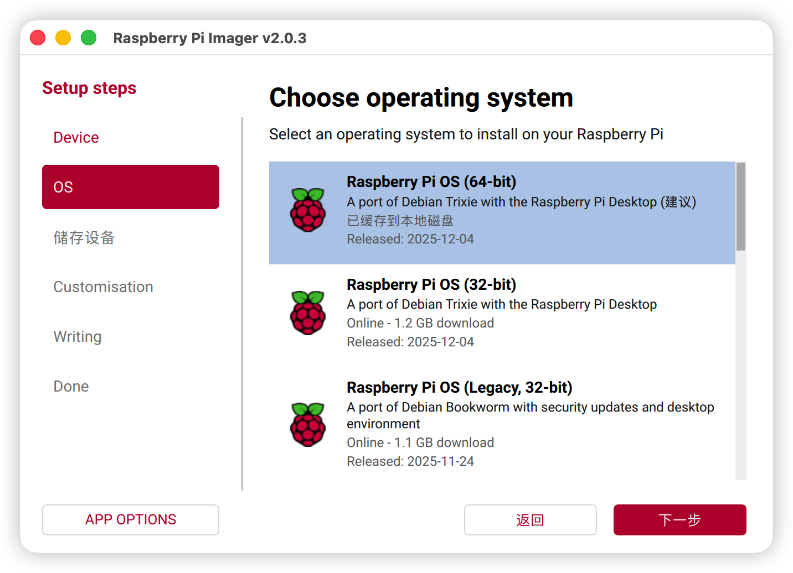

### 2.3 选择存储设备
选择插入的 TF 卡

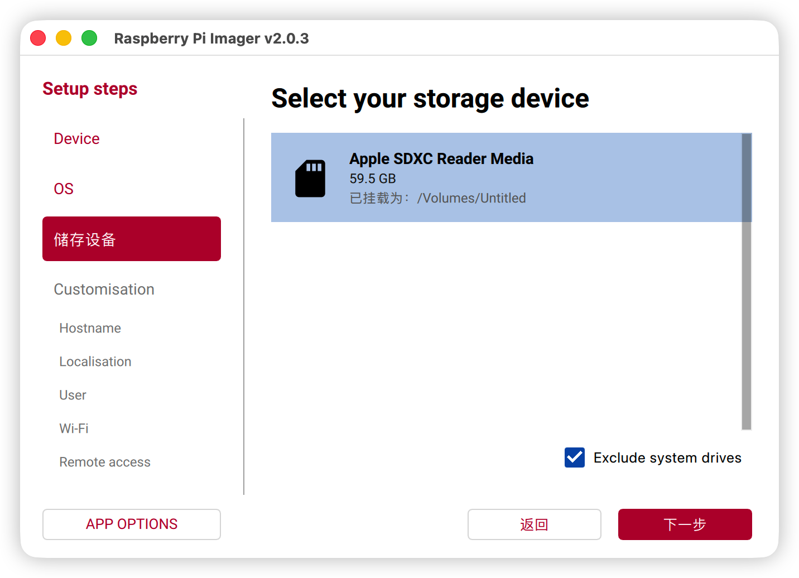

---

## 步骤 3：高级设置（关键）

### 3.1 设置 Hostname
建议设置为：`raspberrypi`（或自定义，如 `snap2know`）

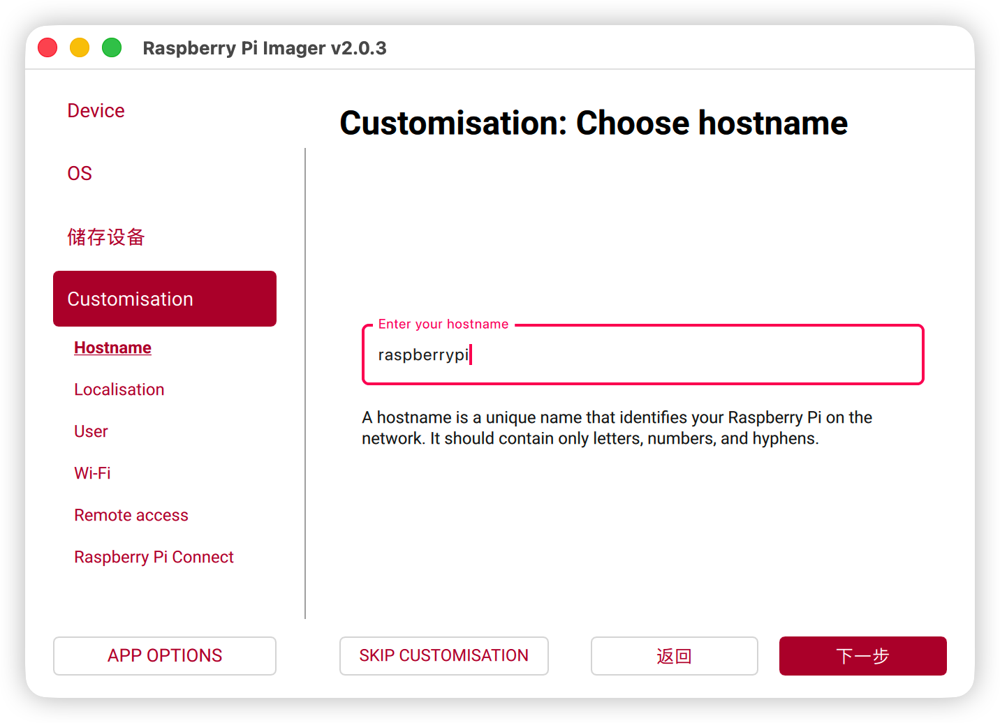

### 3.2 设置时区和键盘布局
- **时区**：Asia/Shanghai
- **键盘**：us（或您的本地布局）

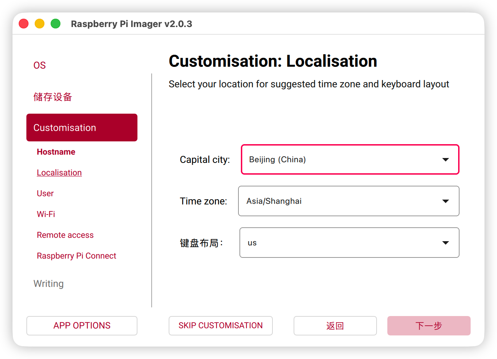

### 3.3 创建用户
- **用户名**：`mars`（或您的自定义用户名）
- **密码**：设置一个安全的密码

> 📝 此用户名将用于后续 SSH 连接：`ssh mars@raspberrypi`


### 3.4 配置 WiFi（推荐）
- **SSID**：您的 WiFi 名称
- **密码**：WiFi 密码

> 💡 提前配置 WiFi 可避免首次启动时连接显示器


### 3.5 启用 SSH（必须）
勾选 **Enable SSH** 并选择 **Use password authentication**

> ⚠️ **必须启用**：Snap2Know 开发完全依赖 SSH 远程操作


### 3.6 启用 Pi Connect（可选）
如需远程访问，可启用 Raspberry Pi Connect

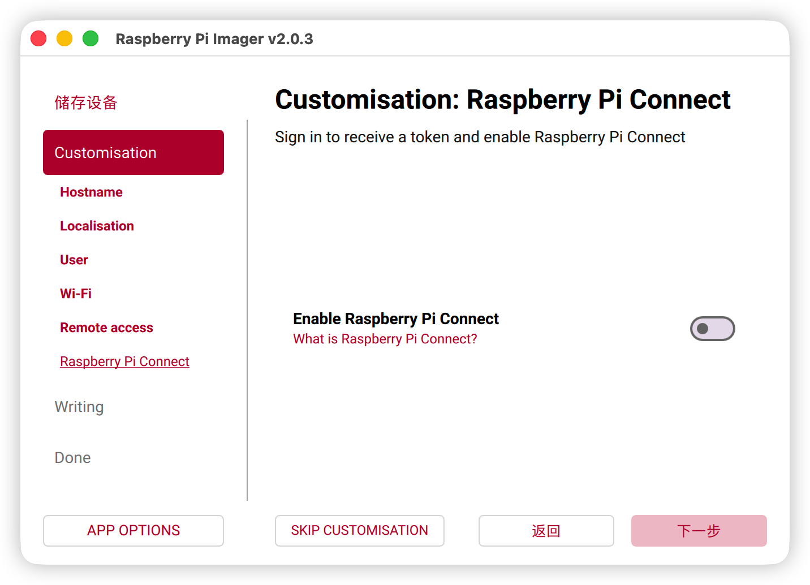

---

## 步骤 4：开始烧录

### 4.1 确认设置
检查所有配置无误后，点击 **Write**

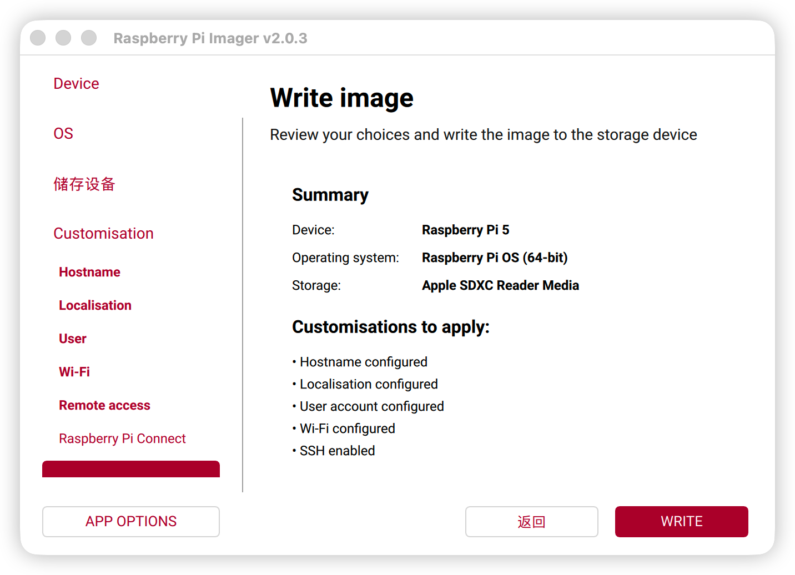

### 4.2 确认擦除
系统提示将擦除 TF 卡所有数据，点击 **Yes**

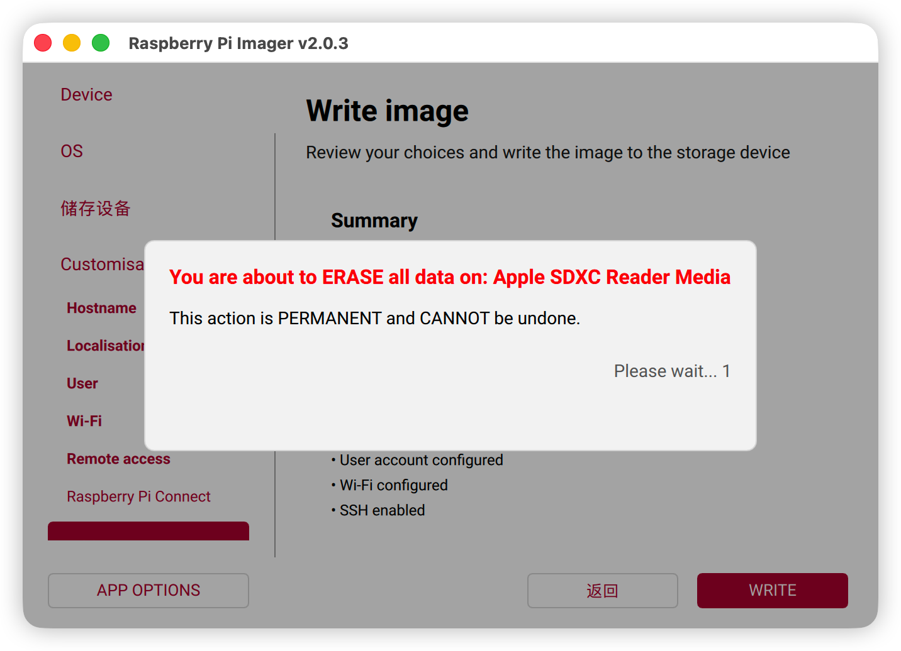

### 4.3 写入镜像
等待镜像写入...（约 5-10 分钟）

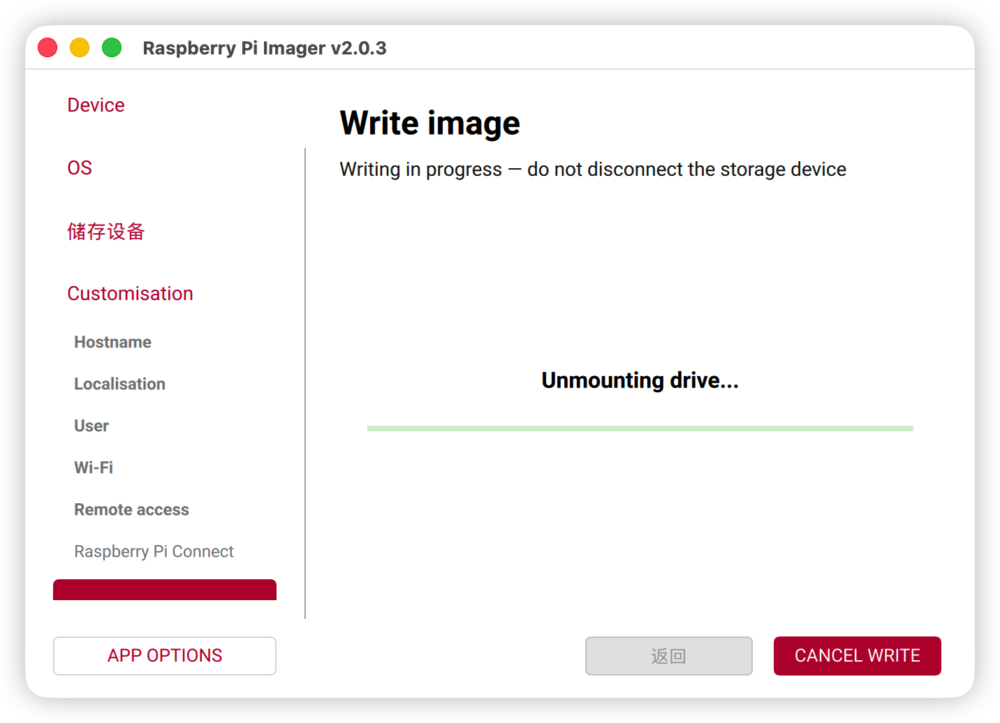


### 4.4 校验镜像
自动校验写入数据的完整性


### 4.5 完成
看到此界面表示烧录成功！


---

## 步骤 5：首次启动验证

1. **安全弹出 TF 卡**，插入 Raspberry Pi 5
2. **接通电源**，等待 1-2 分钟
3. **SSH 连接测试**：

- 使用 `LanScan` 或 `Angry IP Scanner` 获取 Pi 的 IP 地址，后续使用 hostname 连接

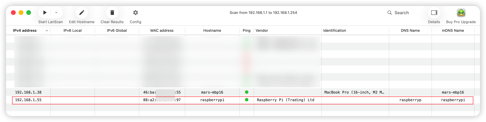


```bash
ssh mars@192.168.1.55

# 验证系统版本
uname -a           # 确认 aarch64
cat /etc/os-release  # 确认 trixie
```

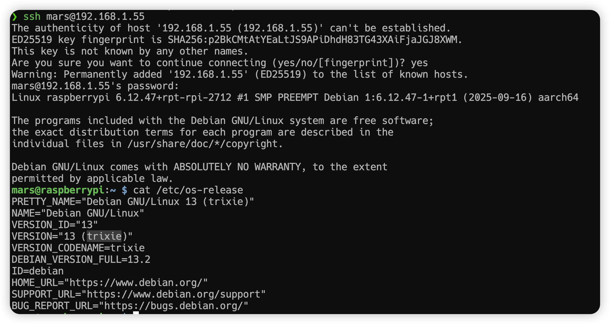

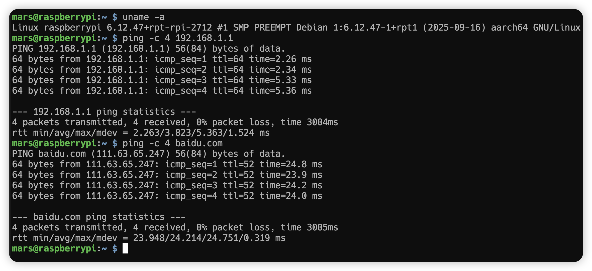


### 可选：提前安装音频依赖

> 💡 这些依赖将在 Day 0.2 正式安装，但可以提前完成

```bash
sudo apt-get update
sudo apt-get install -y alsa-utils ffmpeg
```

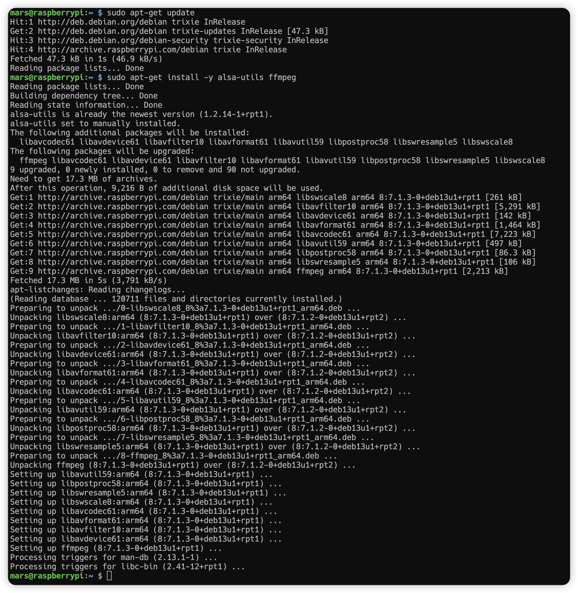


## 设置 root 账号

```bash
sudo passwd root
```

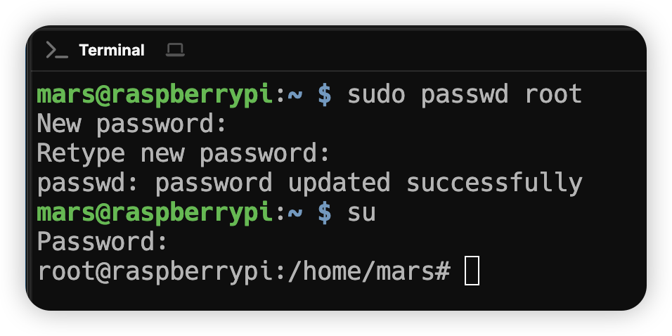

- 创建软件安装相关目录

```shell
sudo mkdir -p /opt/{app,src,release,script}
```

```shell
sudo apt-get install vim
```

- 查看磁盘空间及内存

```shell
df -hT

free -h
```

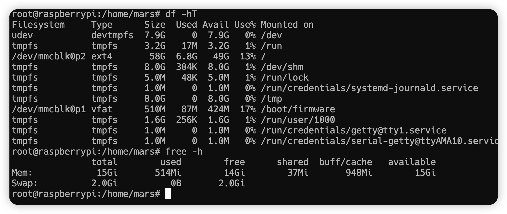

---

## 常见问题

| 问题 | 解决方案 |
|------|----------|
| SSH 连接被拒绝 | 检查 Pi 是否已启动完成（等待 2 分钟）|
| 找不到 `raspberrypi` 主机 | 使用 IP 地址连接，或检查路由器 DHCP 列表 |
| WiFi 未连接 | 首次启动需连接显示器和键盘手动配置 |

---

## 验收清单

- [ ] TF 卡烧录成功，无校验错误
- [ ] Pi 上电后 2 分钟内可通过 SSH 连接
- [ ] `uname -a` 输出包含 `aarch64`
- [ ] `cat /etc/os-release` 显示 `trixie`

---

## 下一步

✅ OS 安装完成，继续执行 [Day-0.2-Whisplay驱动安装.md](./Day-0.2-Whisplay驱动安装.md)
