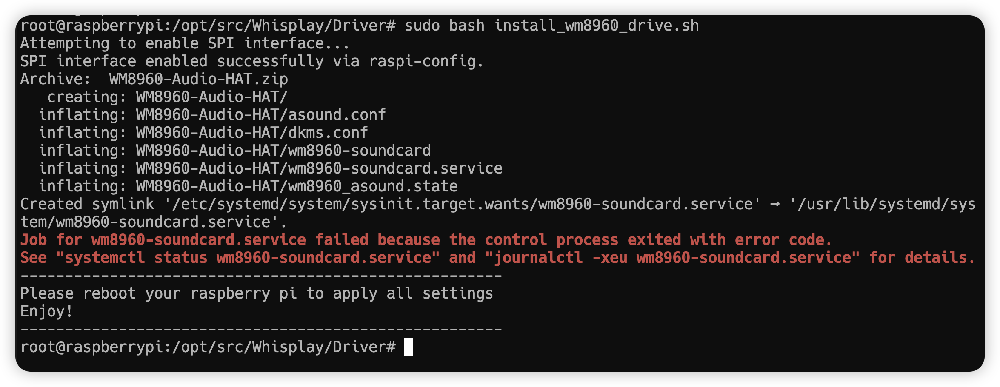

# Day 0.2：Whisplay HAT 驱动安装

> 安装 Whisplay HAT 驱动（WM8960 音频编解码器 + LCD + 按键 + LED）

## 前置要求

- ✅ Day 0.1 完成（Pi OS 已安装，SSH 可连接）
- Whisplay HAT 已正确连接到 Pi 5 的 40-pin GPIO

---

## 步骤 1：更新系统

```bash
ssh mars@raspberrypi
sudo apt-get update && sudo apt-get upgrade -y
```

> ⚠️ 这一步很重要，确保系统是最新的（约 10-30 分钟）


---

## 步骤 2：下载驱动

**方式一**：本地下载后上传
- 从 [GitHub 驱动仓库](https://github.com/PiSugar/Whisplay) 下载
- 上传至 Pi 的 `/opt/src` 目录

**方式二**：Pi 上直接 clone（可能需要代理）
```bash
cd /opt/src
git clone https://github.com/PiSugar/Whisplay.git
```

---

## 步骤 3：安装驱动

```bash
cd /opt/src/Whisplay/Driver
sudo bash install_wm8960_drive.sh
```



安装完成后**重启**：
```bash
sudo reboot
```

---

## 问题排查：wm8960-soundcard.service 启动失败

### 现象

重启后检查服务状态时发现错误：

```bash
sudo systemctl status wm8960-soundcard.service
```

报错信息：
```
wm8960-soundcard.service: Main process exited, code=exited, status=99
wm8960-soundcard.service: Failed with result 'exit-code'.
```

### 诊断步骤

**1. 检查内核版本**
```bash
uname -r
# 输出: 6.12.62+rpt-rpi-2712
```

**2. 检查 overlay 配置**
```bash
cat /boot/firmware/config.txt | grep wm8960
# 输出: dtoverlay=wm8960-soundcard  ✅
```

**3. 检查 dmesg 驱动加载**
```bash
dmesg | grep -i wm8960
```
输出：
```
wm8960 1-001a: supply DCVDD not found, using dummy regulator
wm8960 1-001a: supply DBVDD not found, using dummy regulator
wm8960 1-001a: supply SPKVDD1 not found, using dummy regulator
wm8960 1-001a: supply SPKVDD2 not found, using dummy regulator
```
> ⚠️ 使用 dummy regulator 是正常的，不影响功能

**4. 检查 I2C 设备**
```bash
sudo i2cdetect -y 1
```
输出（地址 `0x1a` 显示 `UU` 表示驱动已占用）：
```
     0  1  2  3  4  5  6  7  8  9  a  b  c  d  e  f
10: -- -- -- -- -- -- -- -- -- -- UU -- -- -- -- -- 
```

**5. 检查声卡是否已注册**
```bash
aplay -l
```
输出：
```
card 2: wm8960soundcard [wm8960-soundcard], device 0: ...
```

### 结论

✅ **WM8960 驱动实际已正常工作**（card 2 已注册）

❌ `wm8960-soundcard.service` 脚本的日志重定向失败导致 exit 99，但不影响驱动功能

### 解决方案

禁用该服务避免日志报错：
```bash
sudo systemctl disable wm8960-soundcard.service
```

---

## 步骤 4：配置 WM8960 为默认声卡

```bash
sudo tee /etc/asound.conf << 'EOF'
pcm.!default {
    type plug
    slave.pcm "plughw:wm8960"
}

ctl.!default {
    type hw
    card wm8960
}
EOF
```

> 使用声卡名称 `wm8960` 而非编号 `2`，避免重启后编号变化

---

## 步骤 5：验证

### 5.1 播放测试
```bash
speaker-test -D plughw:2,0 -c 2 -t wav
```
输出：
```
speaker-test 1.2.14
Playback device is plughw:2,0
Stream parameters are 48000Hz, S16_LE, 2 channels
 0 - Front Left
 1 - Front Right
```
> ✅ 能听到左右声道测试音

### 5.2 录音测试
```bash
arecord -D plughw:2,0 -d 3 -f S16_LE -r 16000 /tmp/test.wav
aplay -D plughw:2,0 /tmp/test.wav
```
> ✅ 能播放刚录制的声音

### 5.3 官方测试脚本
```bash
cd /opt/src/Whisplay/example
sudo bash run_test.sh
```
输出：
```
Using sound card index: 2
wm8960 sound card detected.
Image test.png loaded and displayed initially.
Sound test.mp3 loaded successfully.
INFO: Successfully set 'Speaker' volume to 121 on card 'wm8960soundcard'.
Waiting for button press (Press Ctrl+C to exit)...
Button pressed!
Playing sound concurrently with display changes...
```

> ✅ LCD 显示正常、按键响应正常、音频播放正常

---

## 验收清单

- [x] `aplay -l` 显示 wm8960-soundcard (card 2)
- [x] `speaker-test` 能听到声音
- [x] `arecord` + `aplay` 录放正常
- [x] `run_test.sh` 全部通过（LCD、按键、音频）
- [x] WM8960 已配置为默认声卡
- [x] 已禁用有问题的 service：`sudo systemctl disable wm8960-soundcard.service`

---

## 下一步

✅ Whisplay 驱动安装完成，继续执行 **Day 0.3 摄像头驱动安装**
