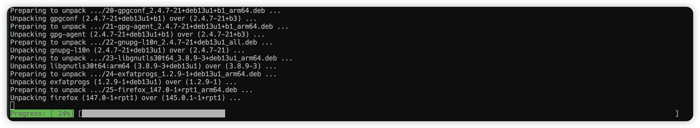
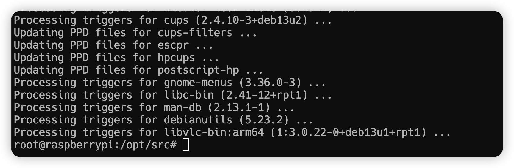

# Day 0.2：Whisplay HAT 驱动安装

```shell
ssh mars@raspberrypi
# 切换到 root 用户
su
```

- 更新系统，这一步很重要，确保系统是最新的（约 10-30 分钟）








- 本地下载 Whisplay 驱动 [github 驱动仓库](https://github.com/PiSugar/Whisplay/tree/main#) 上传至 pi 的 `/opt/src` 目录


- 临时配置代理下载 

```shell
http_proxy=http://192.168.1.38:7897 https_proxy=http://192.168.1.38:7897 git clone https://github.com/whisplay/whisplay-hat.git
```


