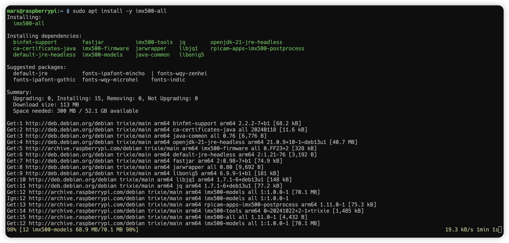
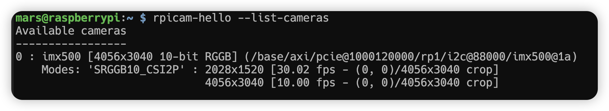
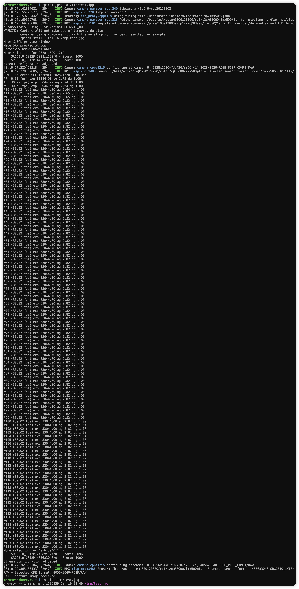
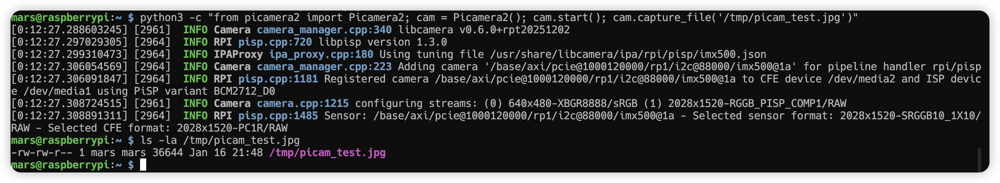
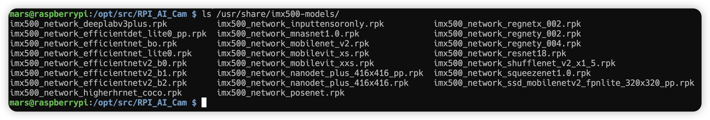

# Day 0.3：摄像头驱动安装

> 安装 Pi AI Camera (Sony IMX500 智能视觉传感器) 驱动

## 前置要求

- ✅ Day 0.2 完成（Whisplay 驱动正常）
- Pi AI Camera (IMX500) 已准备好

---

## 步骤 1：连接摄像头

在开始之前，先将 Pi **正常停机**，然后将 Pi AI Camera 连接到 CSI 接口：

```bash
ssh mars@raspberrypi

# 等待 30s 左右再断开 Pi 的电源
sudo shutdown -h now
```

> ⚠️ **重要**：必须在断电状态下连接 CSI 排线，确保方向正确

---

## 步骤 2：安装 IMX500 驱动

安装完摄像头后重新上电，SSH 登录到 Pi：

```bash
# 更新系统
sudo apt-get update && sudo apt-get upgrade -y

# 安装 IMX500 (驱动包)安装耗时约30-40分钟
sudo apt install -y imx500-all

# 重启生效
sudo reboot
```



---

## 步骤 3：安装 picamera2 和依赖

```shell
# 安装 picamera2（核心库）
sudo apt install -y python3-picamera2

# 安装 OpenCV 和其他依赖（可选，用于 AI 示例）
sudo apt install -y python3-opencv python3-munkres
```

---

## 步骤 4：验证摄像头

### 4.1 检查摄像头是否识别

```shell
sudo apt install -y libcamera-apps

rpicam-hello --list-cameras
```

预期输出应包含 `imx500` 相关信息。

🎉 摄像头已识别！
IMX500 检测成功：

分辨率：4056x3040 (1200万像素)
帧率：10-30 fps




### 4.2 基础拍照测试（Design.md 验收要求）

```bash
# 拍照
rpicam-jpeg -o /tmp/test.jpg

# 检查图片
ls -la /tmp/test.jpg

# 或使用 picamera2 拍照
python3 -c "from picamera2 import Picamera2; cam = Picamera2(); cam.start(); cam.capture_file('/tmp/picam_test.jpg')"
ls -la /tmp/picam_test.jpg
```





---

## 可选：IMX500 AI 功能测试

> 💡 以下步骤用于测试 IMX500 的边缘 AI 推理能力，Snap2Know 项目暂不使用

### 查看预置模型

```bash
ls /usr/share/imx500-models
```



### 运行示例

> 💡 注意：IMX500 边缘 AI 功能需要显示器才能看到实时检测结果。这是可选测试，不影响 Snap2Know 核心功能（拍照 → OCR）。

```bash
cd /opt/src/RPI_AI_Cam/picamera2/examples/imx500

# 目标检测（NanoDet）
# python imx500_object_detection_demo.py --model /usr/share/imx500-models/imx500_network_nanodet_plus_416x416_pp.rpk

DISPLAY= python imx500_object_detection_demo.py --model /usr/share/imx500-models/imx500_network_nanodet_plus_416x416_pp.rpk

# 或使用 SSD MobileNet
python imx500_object_detection_demo.py --model /usr/share/imx500-models/imx500_network_ssd_mobilenetv2_fpnlite_320x320_pp.rpk

# 图像分类
python imx500_classification_demo.py --model /usr/share/imx500-models/imx500_network_mobilenet_v2.rpk

# 姿态估计
python imx500_pose_estimation_higherhrnet_demo.py --model /usr/share/imx500-models/imx500_network_higherhrnet_coco.rpk

# 语义分割
python imx500_segmentation_demo.py --model /usr/share/imx500-models/imx500_network_deeplabv3plus.rpk
```

### 相关资源

- [IMX500 Model Zoo](https://github.com/raspberrypi/imx500-models)
- [COCO Dataset](https://cocodataset.org/)
- [picamera2](https://github.com/raspberrypi/picamera2)

---

## 验收清单

- [x] `rpicam-hello --list-cameras` 能识别摄像头
- [x] `picamera2` 拍照成功，`/tmp/test.jpg` 存在且有内容
- [x] `rpicam-jpeg` 拍照成功

---

## 下一步

✅ 摄像头驱动安装完成，继续执行 **Day 0.4 最小硬件验收（hardware_test.py）**
