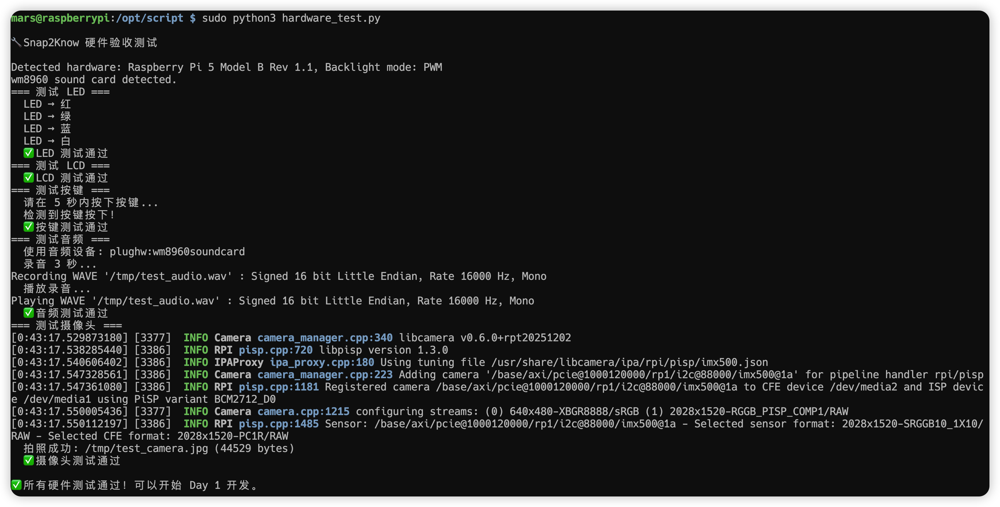

# Day 0.4：最小硬件验收

> **目标**：用单个 Python 脚本验证所有硬件功能正常

## 交付

- `hardware_test.py` 验收脚本
- 所有硬件功能测试通过

## 创建脚本

```shell
cd /opt/script
sudo vim hardware_test.py
```

## 验收脚本内容

```python
#!/usr/bin/env python3
"""最小硬件验收脚本 - Snap2Know Day 0.4"""
import time
import subprocess
from pathlib import Path
import sys, os

# Whisplay 驱动路径
WHISPLAY_PATH = os.environ.get("WHISPLAY_DRIVER_PATH")
if not WHISPLAY_PATH:
    candidates = [
        "/opt/src/Whisplay/Driver",
        os.path.expanduser("~/Whisplay/Driver"),
        "/home/pi/Whisplay/Driver",
        "/home/mars/Whisplay/Driver",
        "/opt/Whisplay/Driver",
    ]
    for path in candidates:
        if os.path.isdir(path):
            WHISPLAY_PATH = path
            break
if WHISPLAY_PATH:
    sys.path.insert(0, WHISPLAY_PATH)
else:
    print("⚠️ 未找到 Whisplay Driver 路径")
    sys.exit(1)

from WhisPlay import WhisPlayBoard

def test_led(ws):
    """测试 RGB LED"""
    print("=== 测试 LED ===")
    colors = [
        ("红", (255, 0, 0)),
        ("绿", (0, 255, 0)),
        ("蓝", (0, 0, 255)),
        ("白", (255, 255, 255)),
    ]
    for name, rgb in colors:
        print(f"  LED → {name}")
        ws.set_rgb(*rgb)
        time.sleep(0.5)
    ws.set_rgb(0, 0, 255)
    print("  ✅ LED 测试通过")

def test_lcd(ws):
    """测试 LCD 显示"""
    print("=== 测试 LCD ===")
    ws.fill_screen(0x001F)  # 蓝色 (RGB565)
    time.sleep(1)
    ws.fill_screen(0x07E0)  # 绿色 (RGB565)
    time.sleep(1)
    print("  ✅ LCD 测试通过")

def test_button(ws):
    """测试按键"""
    print("=== 测试按键 ===")
    print("  请在 5 秒内按下按键...")
    start = time.time()
    pressed = False
    while time.time() - start < 5:
        if ws.button_pressed():
            pressed = True
            print("  检测到按键按下！")
            ws.set_rgb(0, 255, 0)
            time.sleep(0.3)
            ws.set_rgb(0, 0, 255)
            break
        time.sleep(0.05)
    if pressed:
        print("  ✅ 按键测试通过")
    else:
        print("  ⚠️ 未检测到按键，请手动验证")

def test_audio():
    """测试录音和播放"""
    print("=== 测试音频 ===")
    wav_path = "/tmp/test_audio.wav"
    audio_device = "plughw:wm8960soundcard"
    print(f"  使用音频设备: {audio_device}")
    
    print("  录音 3 秒...")
    subprocess.run([
        "arecord", "-D", audio_device, "-f", "S16_LE", 
        "-r", "16000", "-c", "1", "-d", "3", wav_path
    ], check=True, timeout=10)
    
    print("  播放录音...")
    subprocess.run(["aplay", "-D", audio_device, wav_path], check=True, timeout=10)
    
    Path(wav_path).unlink()
    print("  ✅ 音频测试通过")

def test_camera():
    """测试摄像头"""
    print("=== 测试摄像头 ===")
    from picamera2 import Picamera2
    
    cam = Picamera2()
    cam.start()
    time.sleep(1)
    
    img_path = "/tmp/test_camera.jpg"
    cam.capture_file(img_path)
    cam.stop()
    
    size = Path(img_path).stat().st_size
    print(f"  拍照成功: {img_path} ({size} bytes)")
    
    if size > 10000:
        print("  ✅ 摄像头测试通过")
    else:
        print("  ⚠️ 图片过小，请检查")

if __name__ == "__main__":
    print("\n🔧 Snap2Know 硬件验收测试\n")
    
    try:
        ws = WhisPlayBoard()  # 只创建一次实例
        test_led(ws)
        test_lcd(ws)
        test_button(ws)
        test_audio()
        test_camera()
        ws.cleanup()
        
        print("\n✅ 所有硬件测试通过！可以开始 Day 1 开发。\n")
    except Exception as e:
        print(f"\n❌ 测试失败: {e}\n")
        raise
```

## 运行测试

```bash
sudo python3 hardware_test.py
```



## 预期输出

```
🔧 Snap2Know 硬件验收测试

Detected hardware: Raspberry Pi 5 Model B Rev 1.1, Backlight mode: PWM
wm8960 sound card detected.
=== 测试 LED ===
  LED → 红
  LED → 绿
  LED → 蓝
  LED → 白
  ✅ LED 测试通过
=== 测试 LCD ===
  ✅ LCD 测试通过
=== 测试按键 ===
  请在 5 秒内按下按键...
  检测到按键按下！
  ✅ 按键测试通过
=== 测试音频 ===
  使用音频设备: plughw:wm8960soundcard
  录音 3 秒...
Recording WAVE '/tmp/test_audio.wav' : Signed 16 bit Little Endian, Rate 16000 Hz, Mono
  播放录音...
Playing WAVE '/tmp/test_audio.wav' : Signed 16 bit Little Endian, Rate 16000 Hz, Mono
  ✅ 音频测试通过
=== 测试摄像头 ===
[0:43:17.529873180] [3377]  INFO Camera camera_manager.cpp:340 libcamera v0.6.0+rpt20251202
[0:43:17.538285440] [3386]  INFO RPI pisp.cpp:720 libpisp version 1.3.0
[0:43:17.540606402] [3386]  INFO IPAProxy ipa_proxy.cpp:180 Using tuning file /usr/share/libcamera/ipa/rpi/pisp/imx500.json
[0:43:17.547328561] [3386]  INFO Camera camera_manager.cpp:223 Adding camera '/base/axi/pcie@1000120000/rp1/i2c@88000/imx500@1a' for pipeline handler rpi/pisp
[0:43:17.547361080] [3386]  INFO RPI pisp.cpp:1181 Registered camera /base/axi/pcie@1000120000/rp1/i2c@88000/imx500@1a to CFE device /dev/media2 and ISP device /dev/media1 using PiSP variant BCM2712_D0
[0:43:17.550005436] [3377]  INFO Camera camera.cpp:1215 configuring streams: (0) 640x480-XBGR8888/sRGB (1) 2028x1520-RGGB_PISP_COMP1/RAW
[0:43:17.550112197] [3386]  INFO RPI pisp.cpp:1485 Sensor: /base/axi/pcie@1000120000/rp1/i2c@88000/imx500@1a - Selected sensor format: 2028x1520-SRGGB10_1X10/RAW - Selected CFE format: 2028x1520-PC1R/RAW
  拍照成功: /tmp/test_camera.jpg (44529 bytes)
  ✅ 摄像头测试通过

✅ 所有硬件测试通过！可以开始 Day 1 开发。
```

## 验收清单

- [x] LED 四色循环正常
- [x] LCD 颜色切换正常
- [x] 按键响应正常
- [x] 录音/播放正常
- [x] 摄像头拍照正常

---

## 下一步

✅ Day 0 全部完成，可以开始 **Day 1：MBP 基础设施 + 会话 API** 开发