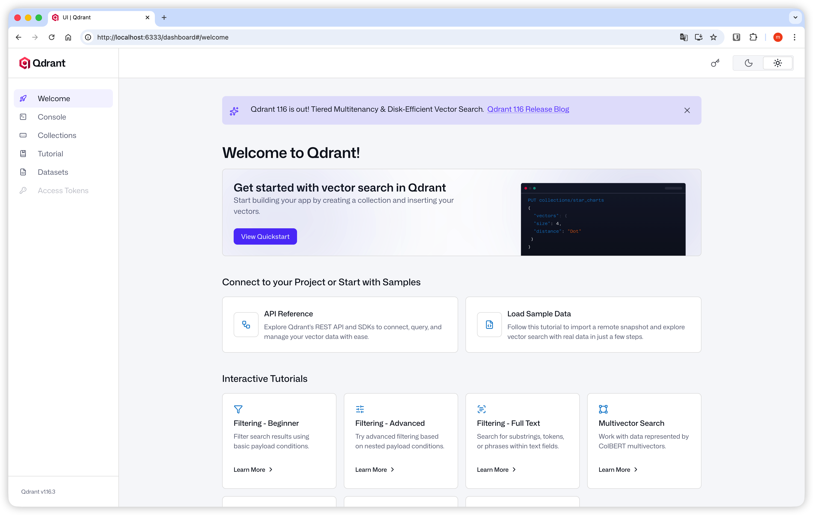
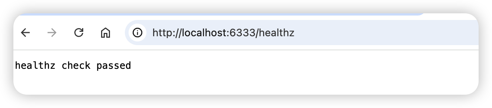

# Day 1：MBP 基础设施 + 会话 API

> **目标**：搭建 MBP 后端基础设施，实现 Qdrant 向量数据库部署和基础会话管理 API

## 前置要求

- ✅ Day 0 完成（Pi 端硬件测试通过）
- Docker Desktop 已安装
- Python 3.12+ 环境就绪

---

## 步骤 1：Qdrant 向量数据库部署

### 1.1 使用 Docker Compose 启动

```bash
cd mbp/

# 启动 Qdrant
docker-compose up -d

# 查看运行状态
docker-compose ps
```

> 💡 `docker-compose.yml` 已配置持久化存储到 `mbp/qdrant_storage/`

### 1.2 验证部署

**命令行检查**

```bash
curl http://localhost:6333/healthz
# 预期输出：healthz check passed
```


**Web UI 检查**

访问 [http://localhost:6333/dashboard](http://localhost:6333/dashboard)





### 1.3 常用命令

```bash
# 停止服务
docker-compose down

# 查看日志
docker-compose logs -f qdrant

# 重启服务
docker-compose restart
```

### 1.4 参考资料

- [Qdrant 官方安装指南](https://qdrant.tech/documentation/quickstart/)

---

## 步骤 2：FastAPI 项目骨架

### 2.1 项目结构

```
mbp/
├── docker-compose.yml     # Qdrant 服务编排
├── qdrant_storage/        # Qdrant 数据持久化
└── snap2know/
    ├── main.py            # FastAPI 入口
    ├── config.py          # 配置管理
    ├── session.py         # 会话管理
    ├── requirements.txt   # Python 依赖
    └── .env.example       # 环境变量模板
```

### 2.2 安装依赖

```bash
cd mbp/snap2know
pip install -r requirements.txt
```

### 2.3 启动服务

```bash
cd mbp/snap2know
/opt/anaconda3/bin/python -m uvicorn main:app --host 0.0.0.0 --port 8000

# 预期输出：
# INFO:     Uvicorn running on http://0.0.0.0:8000 (Press CTRL+C to quit)
```

### 2.4 核心 API

| 端点 | 方法 | 功能 |
|------|------|------|
| `/health` | GET | 健康检查 |
| `/session` | POST | 创建新会话 |
| `/session` | GET | 列出所有会话 |
| `/session/{id}` | GET | 获取会话详情 |
| `/session/{id}` | DELETE | 删除会话 |

### 2.5 验证

```bash
# 健康检查
curl http://localhost:8000/health
# {"status":"ok"}

# 创建会话
curl -X POST http://localhost:8000/session
# {"session_id":"2a225c05","name":null,"created_at":"2026-01-18T08:44:11","image_count":0}

# 列出会话
curl http://localhost:8000/session
# {"sessions":[...],"total":1}

# 获取会话详情
curl http://localhost:8000/session/2a225c05
# {"session_id":"2a225c05","name":null,"created_at":"...","image_count":0}

# 删除会话
curl -X DELETE http://localhost:8000/session/2a225c05
# {"deleted":true,"session_id":"2a225c05"}
```

### 2.6 API 文档

启动服务后访问：
- Swagger UI: [http://localhost:8000/docs](http://localhost:8000/docs)
- ReDoc: [http://localhost:8000/redoc](http://localhost:8000/redoc)

---

## 验收清单

- [x] `docker-compose.yml` 创建完成
- [x] Qdrant Docker 容器运行正常
- [x] `curl http://localhost:6333/healthz` 返回 `healthz check passed`
- [x] Qdrant Web UI 可访问
- [x] FastAPI 骨架实现
- [x] 会话 API（POST/GET/DELETE）实现
- [x] API 文档可访问

---

## 下一步

✅ Day 1 完成，继续 **Day 2：STT + TTS API** 开发
