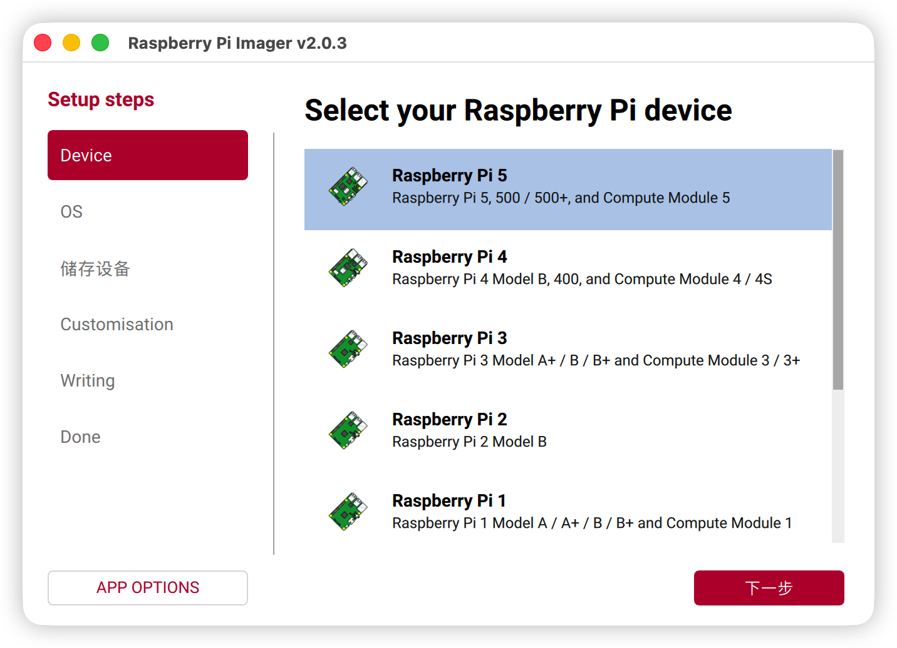
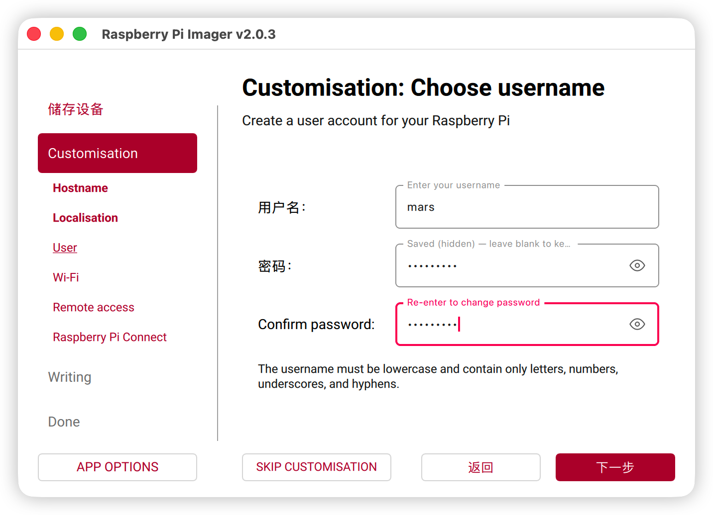
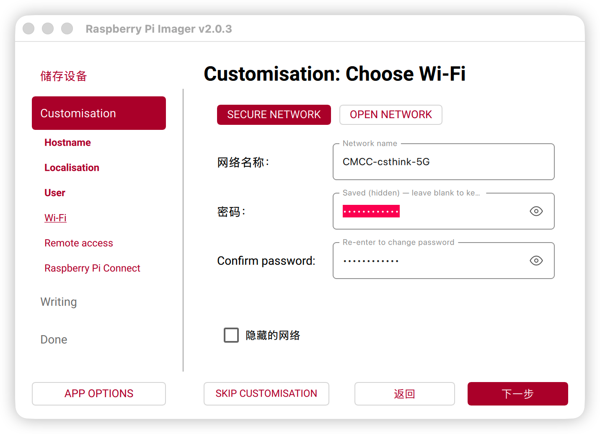
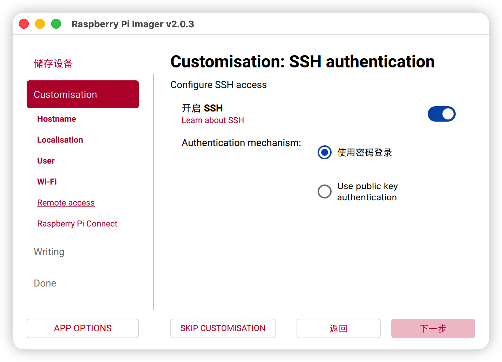
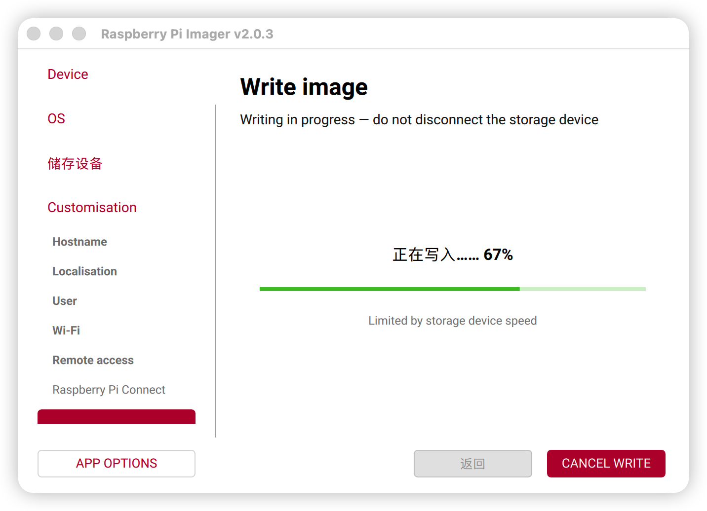
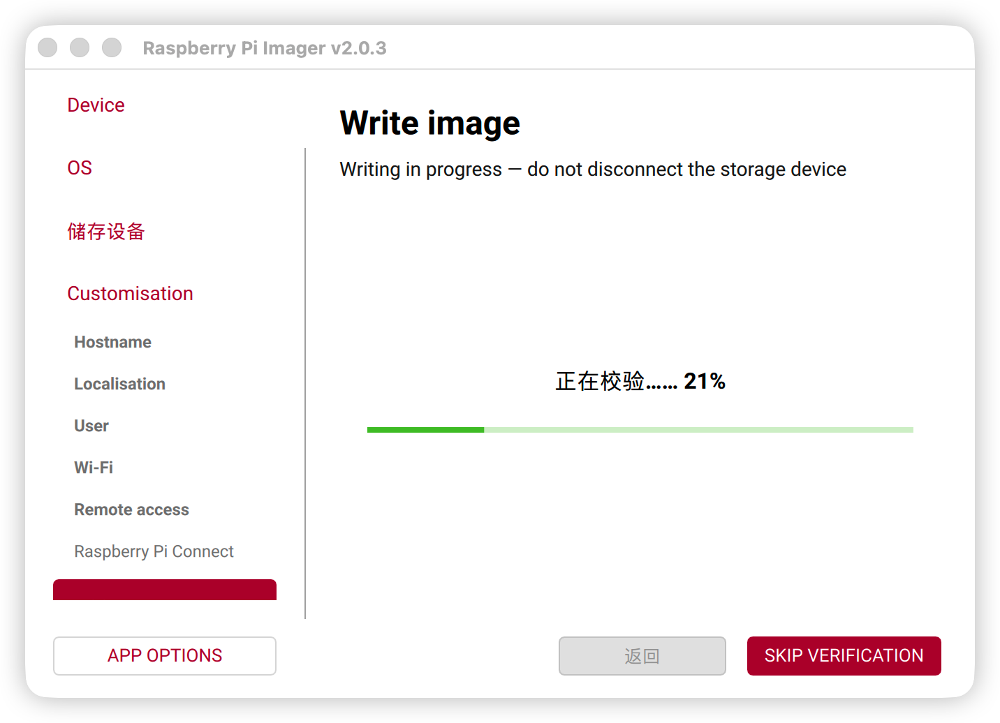
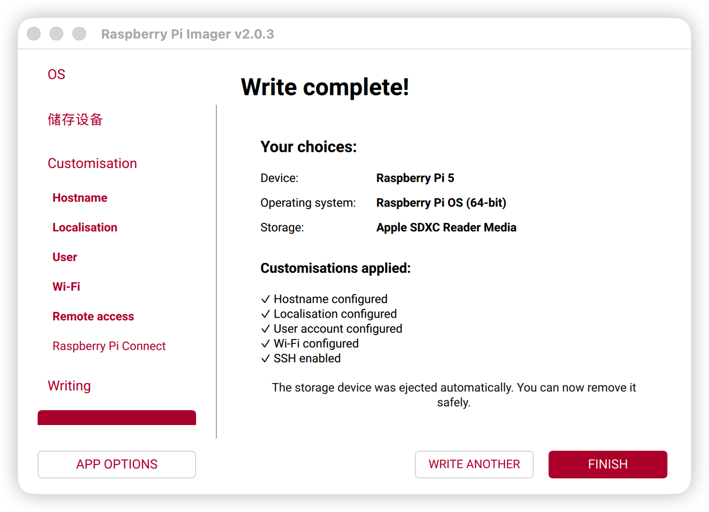

# Raspberry Pi OS 安装

1. 下载 Raspberry Pi Imager
[Raspberry Pi Imager](https://www.raspberrypi.com/software/)

2. 烧录 Raspberry Pi OS

- 选择设备

- 选择操作系统

- 选择SD卡

- 设置 hostname

- 设置时区和键盘布局

- 创建用户

- 设置WiFi网络

- 开启SSH

- 开启 Pi Connect[可选]

- 确认设置，准备烧录

- 提示擦除SD卡

- 写入镜像

- 镜像写入中

- 校验镜像

- 镜像写入完成

